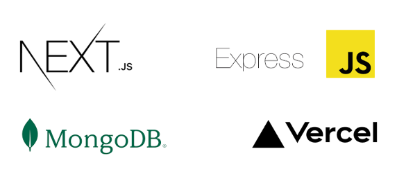

# Tugas Akhir PAW Kelompok 10 2024

## Team Member  👤

1. Deren Tanaphan (22/503261/TK/54976)
2. Aisa Selvira Q.A (22/498561/TK/54690)
3. Moh. Nazril Ilham (22/493142/TK/54000)
4. Muhammad Rafli Ramadani (22/497787/TK/54571)
5. Satama Safika (22/492880/TK/53955)

## Overview Aplikasi BookNest 📖

BookNest adalah sebuah aplikasi manajemen perpustakaan berbasis web yang dirancang untuk mendukung dua jenis peran pengguna, yaitu admin dan peminjam/pengunjung. Aplikasi ini memberikan admin kemampuan untuk mengelola perpustakaan dengan efisien, seperti menambahkan, memperbarui, dan menghapus data buku. Sementara itu, peminjam dapat dengan mudah mencari, meminjam, serta mengembalikan buku yang tersedia. Aplikasi ini juga dilengkapi dengan fitur pencarian buku yang canggih, pembaruan ketersediaan buku secara real-time, serta antarmuka yang user-friendly, untuk mempermudah pengelolaan perpustakaan dan meningkatkan pengalaman pengguna.

## Pembagian Tugas 📋

1. Deren Tanaphan => UI, Front end, dan Back end
2. Aisa Selvira Q.A => UI dan Front end
3. Moh. Nazril Ilham => UI dan Front end
4. Muhammad Rafli Ramadani => UI dan Front end
5. Satama Safika => UI dan Front end

## Backend Setup 🔧

[Github Repository Backend](https://github.com/Lev1reG/be-final-project-paw10)

Untuk menjalankan backend terlebih dahulu:

1. Pastikan Node.js dan npm sudah terinstal di sistem Anda.
2. Clone repository backend dengan perintah berikut:
   ```bash
   git clone https://github.com/Lev1reG/be-final-project-paw10.git
   ```
3. Masuk ke folder proyek backend:
   ```bash
   cd be-final-project-paw10
   ```
4. Buat file `.env` di dalam folder proyek dan tambahkan variabel berikut:
   ```env
   MONGODB_URI=your_mongodb_uri_here
   CRYPTO_SECRET=your_crypto_secret_here
   JWT_VERIFICATION_SECRET=your_jwt_verification_secret_here
   ```
5. Install dependencies yang dibutuhkan:
   ```bash
   npm install
   ```
6. Jalankan server backend:
   ```bash
   npm run start
   ```
   Server akan berjalan di port default, misalnya `http://localhost:5000`.

Setelah backend berjalan, Anda dapat melanjutkan dengan menjalankan server frontend menggunakan panduan pada bagian **Getting Started**.

## Getting Started 💻

Untuk menjalankan server frontend:

1. Pastikan Node.js dan npm sudah terinstal di sistem Anda.
2. Clone repository frontend dengan perintah berikut:
   ```bash
   git clone https://github.com/Lev1reG/fe-final-project-paw10.git
   ```
3. Masuk ke folder proyek frontend:
   ```bash
   cd fe-final-project-paw10
   ```
4. Buat file `.env.local` di dalam folder proyek dan tambahkan variabel berikut:
   ```env
   NEXT_PUBLIC_BACKEND_URL=http://localhost:5000
   ```
5. Install dependencies yang dibutuhkan:
   ```bash
   npm install
   ```
6. Jalankan server frontend:
   ```bash
   npm run dev
   ```

Server akan berjalan di port default, misalnya `http://localhost:3000`.

## Teknologi 🌐


##  Link Deployment BookNest 🔗
[BookNest Deployment](https://www.booknest.web.id/)


##  Link Video dan PPT 🔗

[Link Video](https://drive.google.com/drive/folders/1I4WM3vfKYiDnzmn7u58MaKwb_DzlUuJH?usp=sharing)

Link PPT =>


